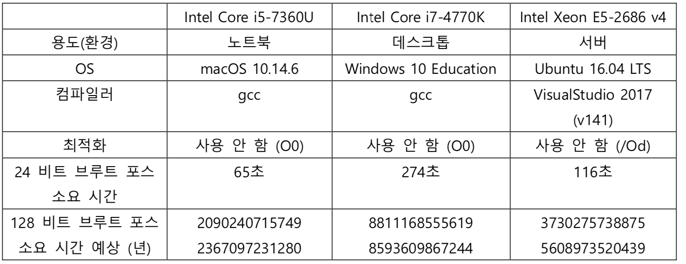

# CBNU 2019-03 Information Security

2019학년도 2학기 정보보호 과제

## Object

AES128 브루트 포싱 시간 예측

## Method

24비트 브루트 포싱 하는시간 계산 후
2<sup>127</sup> / 2<sup>24</sup> 시간 측정하면 된다.

## Test

> Build
make all to build

```
make all
```

> Encrypt

Key : ABCDABCDABCDABCDABCDABCD12345678

Plain Text : JungBoBoHo Gazua

Encrypted : 26 26 1d 7c 5f 83 09 a7 95 9e 00 97 05 60 a8 d3

> Decrypt

Key : Same as Encryption 

Decrypted : JungBoBoHo Gazua

(same as plain text before encrypt)

> Brute-force

Measuring time (sec) for brute forcing 24bit AES

## Brute-force Result

